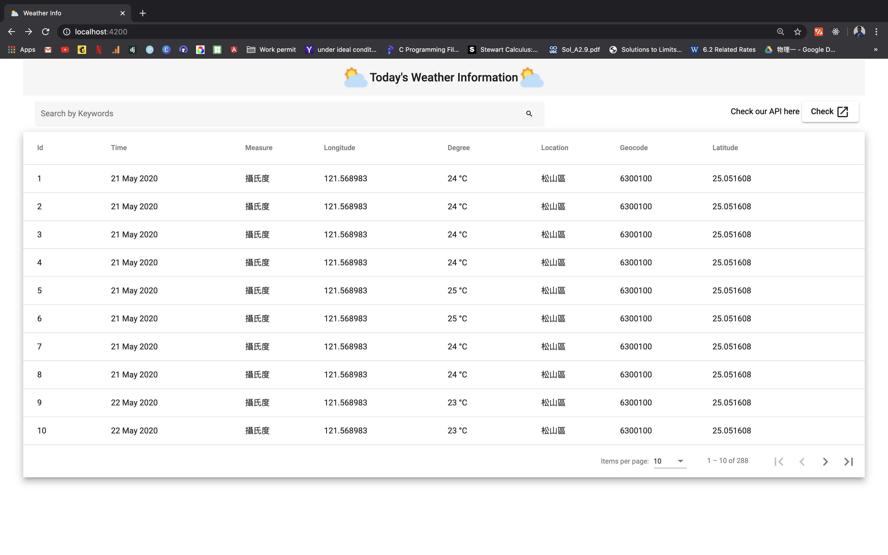

# Weather Web App

Weather web app is a MEAN app which uses Mongodb, Express, Angular and Nodejs. It displays the weather from this url : "https://data.taipei/opendata/datalist/apiAccess?scope=resourceAquire&rid=1f1aaba5-616a-4a33-867d-878142cac5c4" as a table with search, filter and sort functionalities.

In this project, I did the following steps: 

1- Build a front-end web page with Angular and go to https://data.taipei/ to retrieve "今日氣象資訊" data, and organize and display the data to users by: 
- Using a Table to display the original data.
- Adding filter, search, sort features for the Table.

2- Build a back-end system with Node.js, Express.js, MongoDB and go to the same link https://data.taipei/ to retrieve "今日氣象資訊" data, and store it in a database. This back-end system also provides a public API interface, so that other parties can read the contents of the database through the API. Update the data in the database every hour. 

3- When the original API link is not available, use the data in the database as a backup for the Table. 

This project was generated with [Angular CLI](https://github.com/angular/angular-cli) version 9.1.1.

## Installation

- Run `git clone https://github.com/ClaudyV/weather-web-app.git`
- Run `cd weather-web-app`
- Run `npm install` to get all dependencies 
- Run `cd weather-web-app/server`
- Create a Mongo Database with the name "Weather" 
- Create a Mongo Database Collection with the name "info"
- Run `nodemon index.js` to start nodejs server
- Open another terminal and go the folder weather-web-app => `cd weather-web-app`
- Run `npm start` to start Angular Development Server
- Navigate to `http://localhost:4200/`. The app will automatically reload if you change any of the source files.
- Navigate to `http://localhost:4200/api/weather-info` to see the REST api

## Demo 

